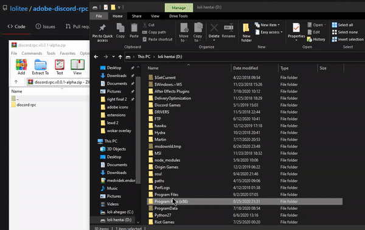

**CEP server on default uses port 6767 so make sure nothing runs on that port, otherwise the API server wont start and will error out!**

Method 1

- Unzip the zip file which contains "adobe rpc" into C:/Program Files (x86)/Common Files/Adobe/CEP/extensions
- Make sure you have turned on debug mode more information in: https://github.com/Adobe-CEP/Getting-Started-guides/tree/master/Client-side%20Debugging (the reason is because I didn't sign the extension) (if theres for example csx 9/10 in regedit then create the PlayerDebugMode for them too)
- Open any adobe app that is being supported by this extension
- On top of the window "Window -> Extensions -> Discord Rich Presence"

Method 2 (untested)

- Install any applications that supports .zxp file
- import the file there
