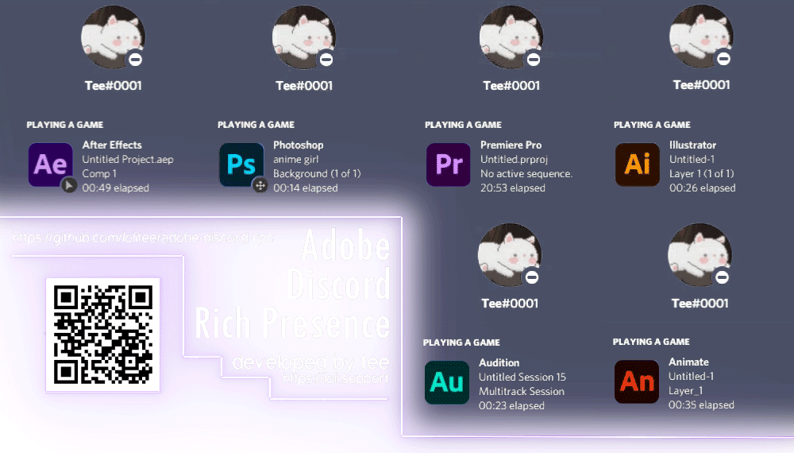

# Adobe Discord Rich Presence

Adobe Discord Rich Presence is an extension that connects Adobe apps with Discord and provides information for your profile. The extension auto-launches on app start up!

[UXP Version of extension](https://github.com/teeteeteeteetee/adobe-discord-rpc-uxp) (in progress)
# Please do not clone the repository, get the extension from "Releases" https://github.com/teeteeteeteetee/adobe-discord-rpc/releases

**Supports**:
- After Effects
- Photoshop
- Premiere Pro
- Audition
- Illustrator
- Animate 
- Prelude (broken)
- Dreamweaver 
- InDesign
- InCopy

**Doesn't support**:
- Media Encoder
- Acrobat
- Premiere Rush

# donations ty so much
- [ ] AARIX#1312 - 3$
- [ ] Misile - 4$ (in crypto)
- [ ] bdan - 6$ 
- [ ] bran - 5$ (special ty for helping me out)
- [ ] wertos - 3$
- [ ] Infernodan - 3$ 
- [ ] Tambur - 3$
- [ ] Koen - 9$
- [ ] Ventriquo - 3$

[Installation guide](https://github.com/teeteeteeteetee/adobe-discord-rpc/blob/master/GUIDE.md)

[Support server](https://discord.gg/RGtxbuFtzb) - use it if rly needed

- This extension is based off [Adobe-Cep-React-Create](https://github.com/HendrixString/adobe-cep-react-create)
